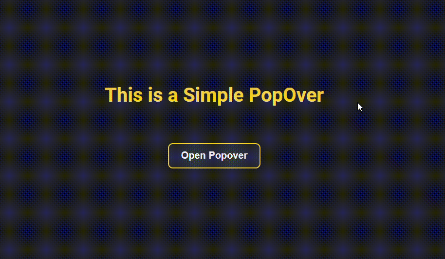

# HTML & CSS Cheat Sheet 2025

 This is a collection of useful HTML and CSS tips and tricks that I've found useful over the years. It's a work in progress and I'll be adding more features and sections as I go. 

## 1. [Popover Menu Code](PopOver-Menu)

💡 Key Takeaway
Popovers enhance UI functionality while keeping the design clean and user-friendly. By strategically using them, you can provide more contextual interactivity and improve user engagement.

